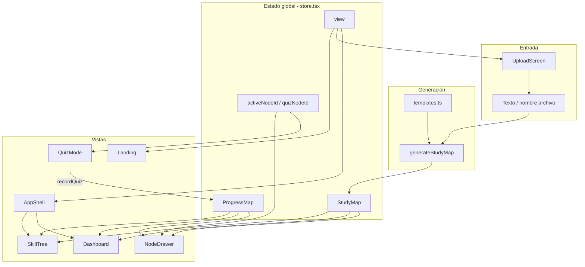
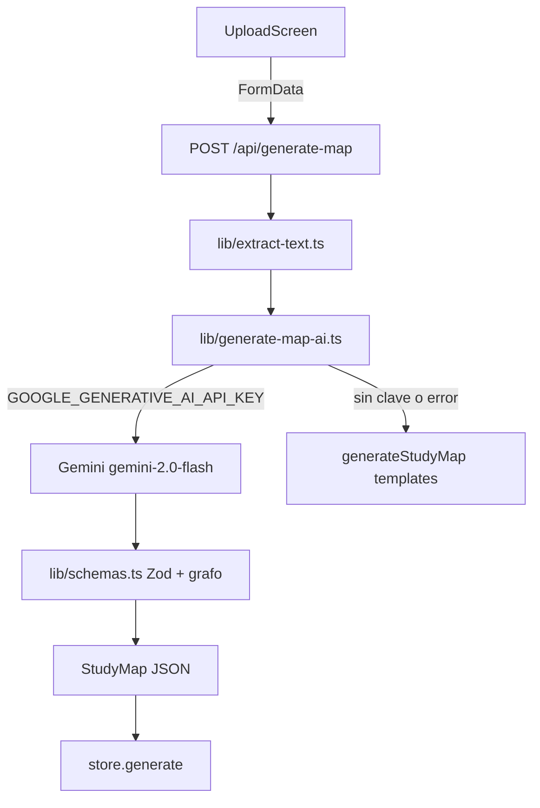

# Arquitectura y estructura

## Estructura de carpetas

```
study-map-app/
├── app/                    # Next.js App Router
│   ├── globals.css         # Tema, tokens Tailwind, estilos base
│   ├── layout.tsx          # Root layout, fuentes, metadata, Analytics
│   └── page.tsx            # Entry: StudyProvider + AppShell
├── components/
│   ├── ui/                 # Componentes shadcn (Button, …)
│   ├── app-shell.tsx       # Shell y navegación principal
│   ├── brand.tsx           # Logo, ThemeToggle
│   ├── dashboard.tsx       # Vista de progreso
│   ├── landing.tsx         # Landing page
│   ├── node-drawer.tsx     # Panel lateral de concepto
│   ├── node-field.tsx      # Fondo animado (canvas)
│   ├── quiz-mode.tsx       # Modo test fullscreen
│   ├── skill-tree.tsx      # Grafo / lista de nodos
│   └── upload-screen.tsx   # Subida de apuntes
├── lib/
│   ├── store.tsx           # Context + estado global
│   ├── study.ts            # Lógica de dominio
│   ├── templates.ts        # Plantillas de asignaturas
│   ├── types.ts            # Tipos TypeScript
│   └── utils.ts            # cn() helper
├── public/                 # Assets estáticos (iconos, placeholders)
├── docs/                   # Esta documentación
├── components.json         # Config shadcn
├── next.config.mjs
├── package.json
├── postcss.config.mjs
└── tsconfig.json
```

## Diagrama de flujo de datos



## Modelo de datos — `lib/types.ts`

### `Mastery`

```ts
"locked" | "red" | "amber" | "green"
```

### `QuizQuestion`

```ts
{ id, question, options[], correctIndex, explanation }
```

### `KnowledgeNode`

```ts
{
  id: string
  title: string
  summary: string      // resumen corto (poco usado en UI actual)
  detail: string       // explicación en drawer
  examples: string[]
  level: number        // profundidad en el árbol (0 = raíz)
  deps: string[]       // IDs de prerrequisitos
  questions: QuizQuestion[]
}
```

### `StudyMap`

```ts
{
  id: string
  subject: string
  source: string
  createdAt: number
  nodes: KnowledgeNode[]
}
```

### `NodeProgress` / `ProgressMap`

```ts
NodeProgress = { score: 0-100, mastery: Mastery, attempts: number }
ProgressMap = Record<nodeId, NodeProgress>
```

## Lógica de dominio — `lib/study.ts`

### Generación de mapas

`generateStudyMap({ text, source })`:

1. Concatena `text + source` en minúsculas
2. Puntúa cada plantilla de `templates.ts` por keywords coincidentes (`match[]`)
3. Elige la plantilla con más coincidencias; si ninguna, rota entre plantillas
4. Devuelve un `StudyMap` con nodos de la plantilla elegida

**No hay parsing real de PDF ni llamada a IA.**

### Sistema de mastery

| Función | Regla |
|---------|-------|
| `masteryFromScore(score)` | ≥80 → green, ≥40 → amber, else red |
| `isUnlocked(node, progress)` | Sin deps → true; con deps → todos amber o green |
| `getMastery(nodeId, node, progress)` | Si hay progreso → su mastery; si no → red si unlocked, else locked |

### Desbloqueo

Un nodo se desbloquea cuando **todos** sus prerrequisitos (`deps`) tienen mastery `amber` o `green` (score ≥ 40).

### Estadísticas

`computeStats(map, progress)` devuelve:

- Conteos por mastery (`green`, `amber`, `red`, `locked`)
- `overall`: media de scores (green cuenta como 100)
- `weak`: nodos amber + red (para repaso)

### Layout del grafo

`layoutNodes(nodes)`:

- Agrupa nodos por `level` (filas)
- Espaciado: `colGap=260`, `rowGap=200`, padding `140/120`
- Centra cada fila horizontalmente
- Devuelve `{ positioned, width, height }`

## Plantillas — `lib/templates.ts`

Tres asignaturas predefinidas:

| Key | Subject | Keywords ejemplo |
|-----|---------|------------------|
| `biologia` | Biología celular | celula, adn, mitocondria… |
| `historia` | Revolución Industrial | historia, revoluc, industrial… |
| `programacion` | Fundamentos de Programación | program, javascript, algoritmo… |

Cada plantilla tiene 8–10 nodos en árbol con `level` y `deps`, y 3 preguntas por nodo.

**Para añadir una asignatura:** crear un `SubjectTemplate` y añadirlo al array `templates`.

## Vistas y navegación

| `view` | Pantalla | Cómo llegar |
|--------|----------|-------------|
| `landing` | Landing | Inicio, reset, click en Logo |
| `upload` | UploadScreen | CTAs "Subir apuntes", "Empezar", "Nuevo mapa" |
| `app` | App principal | Tras generar mapa en upload |

Dentro de `app`, tabs locales en `AppShell`:

| Tab | Componente |
|-----|------------|
| `tree` | SkillTree |
| `dashboard` | Dashboard |

## Capas de la aplicación

```
┌─────────────────────────────────────┐
│  Presentación (components/)         │
│  Landing, SkillTree, Quiz, etc.     │
├─────────────────────────────────────┤
│  Estado (lib/store.tsx)             │
│  React Context, sin persistencia    │
├─────────────────────────────────────┤
│  Dominio (lib/study.ts)             │
│  Mastery, stats, layout, generación │
├─────────────────────────────────────┤
│  Datos (lib/templates.ts)           │
│  Plantillas estáticas en memoria    │
└─────────────────────────────────────┘
```

## Metadata y SEO — `app/layout.tsx`

- Título: "Mapa de Estudio — Convierte tus apuntes en conocimiento"
- `lang="es"`
- Iconos adaptativos claro/oscuro
- `colorScheme: light dark`

## Generación con IA



| Archivo | Rol |
|---------|-----|
| `app/api/generate-map/route.ts` | Endpoint POST (FormData: text, source, file) |
| `lib/extract-text.ts` | Extrae texto de PDF/TXT/MD |
| `lib/generate-map-ai.ts` | Llama Gemini (AI Studio); fallback a plantillas |
| `lib/schemas.ts` | Esquema Zod + validación de grafo acíclico |
| `lib/prompts.ts` | System/user prompts en español |

Variables de entorno: ver `.env.local.example` (`GOOGLE_GENERATIVE_AI_API_KEY`, `GEMINI_MODEL` opcional).

## Extensiones futuras

| Feature | Dónde tocar |
|---------|-------------|
| DOCX | `lib/extract-text.ts` + mammoth |
| Persistencia | localStorage en `store.tsx` o backend |
| Auth | Nuevo provider + middleware |
| Más asignaturas | `lib/templates.ts` |
| Tests E2E | Nueva carpeta `tests/` o `e2e/` |

## Alias de imports

```ts
@/components → ./components
@/lib        → ./lib
@/components/ui → ./components/ui
```

Definido en `tsconfig.json` paths y `components.json` aliases.
